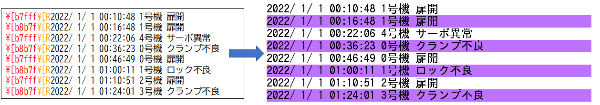
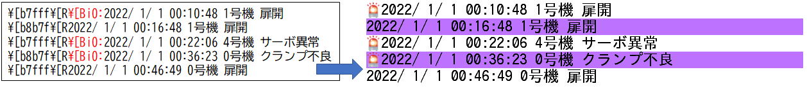
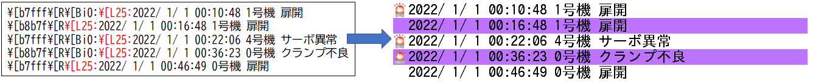
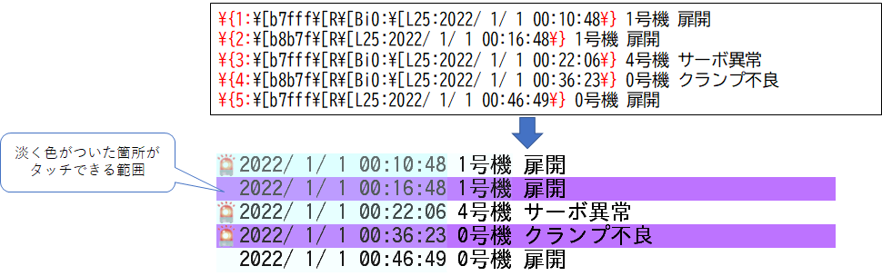

# GOP-CT70Aでのスクロールリスト実装
下のようなタッチでスクロールするリストの表現がGOP-CT70Aでは可能です。  
本記事では、このような画面の設計方法とホストから表示する内容を書き換える仕組み、およびサンプルコードについて説明します。  
  
## 1．TPデザイナーLTの設定  
### (1)フォントの登録  
  
まず、フォントの登録を行います。  
TPデザイナーLTでは、PCにインストールされているフォントからGOP-CT70Aで使用できるフォントを生成する機能があります。  
以下の手順で生成します。  
  
  
### (2)文字オブジェクトの配置  
  
リストの表示には文字オブジェクトを使用します。  
オブジェクトを配置し、プロパティシートで  
* 「登録フォントの使用」を「する」
* 「縦スクロール」を「する」  
  
に設定すると、配置した文字オブジェクトを任意サイズに拡縮できるようになります。  
位置を調整し、
* 「表示文字」に任意の長い文字列を設定します。  
  
これでGOPに書き込むと、ドラッグでスクロールするリストが出来ます。  

  
   
### (3)RAMバッファー使用の設定  
  
文字オブジェクトで任意データを表示出来るようにします。  
オブジェクトのプロパティシートで  
* 「RAMバッファーの使用」を「する」  
  
に設定します。  
RAMバッファーとはホストから通信で任意のファイルを書き込み可能なRAMディスクのような領域です。  
16byteのブロックが65535個あり、合わせて1Mbyteのサイズがあります。  
ホストから任意のブロック位置を指定し、そこにテキストファイルを書き込みます。  
RAMバッファーを使用するように設定すると、RAMバッファーアドレス指定メモリーが追加されます。  
ここに参照するテキストファイルが書き込まれたブロック番号を書き込むとテキストファイルの内容の描画が行われます。  

この設定でGOPに書き込み、通信画面からテキストファイルを送信しRAMバッファーアドレス指定メモリーにブロック番号を書き込むと書き込んだ内容が表示されます。  
  
  

以上の設定で、ホストが持つ任意のデータをGOP-CT70Aに表示させスクロールさせることができます。  
  
なお、リストの表示として使用する場合、配置を左寄せにしないと位置の調整が難しいため  
オブジェクトのプロパティシートで  
* 「配置」を「左寄せ」  
とします。  
  

***  
## 2.リストの装飾  
  
GOPの文字表示機能ではエスケープシーケンスという文字列に埋め込むコマンドで表示を装飾することが可能です。  
以下に 
* 背景の塗分け
* 画像の埋め込み
* 位置ぞろえ
* タッチエリアの設定  
  
について説明します。

なおエスケープシーケンスの表示の確認は、「RAMバッファー使用」を「しない」に戻し、「表示文字」で設定することでどのように表示されるか確認できます。

### (1)行の塗分け  

行ごとに背景の色を変えたい場合、背景色の変更コマンドと行塗りつぶしコマンドを、各行に先頭に付加します。  

背景色変更　&yen;[b(4桁の色コード)  &yen;[b7fff  
行塗りつぶし &yen;[R  


  

### (2)画像埋め込み  
  
リスト中にビットマップを埋め込むことも可能です。  
例えば状態を表すアイコンなどをリスト中に表示できます。  

画像埋め込み　&yen;[Bi(ビットマップ番号): 　行高さに縮小表示  
　　　　　　　&yen;[Bo(ビットマップ番号): 　元画像の大きさで表示  
　　　　　　　&yen;[Bc(ビットマップ番号): 　文字高さに縮小表示  
※BiとBcは\\[vコマンドで文字位置を変更していない場合、同じ表示です  
  
  

※上図でビットマップパレットの0にはが登録されています。
  
### (3)位置ぞろえ  
  
リスト中に表示位置を揃えるため文字の位置を指定することも可能です。  

位置指定　&yen;[L(X位置);(Y位置):  
  
　Y位置は省略可能です。その場合以下の表記となります。  
　　　　　&yen;[L(X位置):  
  
  
  
### (4)タッチエリアの設定  
  
リスト中の任意の項目をタッチで選択することも可能です。  

タッチ可能エリア開始　&yen;{(id);(押下時色番号);(無押下時色番号):  
　　　　　　　　　　　～(この範囲に表示されている文字画像を選択可)  
　　　　　　　　　　　&yen;}  
※押下時色番号、無押下時色番号は省略可能です。   
  
  
  

なおタッチによる選択動作を有効にするには文字オブジェクトの
* 「タッチ検出」を「する」 
にします。  

するとタッチブルエリアIDのメモリーが追加されます。  
エリアをタッチするとエスケープシーケンスで指定したidがこのメモリーに格納されます。  
  
またタッチで選択を行うとタッチブルエリアタッチ時のアクションを指定できます。  
* 「タッチブルエリアタッチ時のアクション」でタッチブルエリアIDのメモリーの値をホストに送信するアクション  
  
を設定するとホストでどこが押されたか検出できます。  

  


***
## 3.ホストとの連携  
  
GOPの画面を1.章のように設計し  
ホスト側で2.章の内容に従ってテキストデータを生成し送信することで  
ホストが持つログ情報を表示するスクロールリストを表現できます。  
  
具体的なコードは以下のようになります。  
  
動作の詳細はソース中のコメントを参照してください。  
GOPとのコマンド処理は当社にて用意しているライブラリ```goplt_if.c```、```goplt_if.h```にて定義している関数を使用します。  
これらのライブラリは1文字送受信やシステム時刻取得(ms単位)など基本的な動作を用意していただければ簡単に移植可能です。  

```C
#include "stdio.h"
#include "stdlib.h"
#include "goplt_if.h"
#if defined(WIN32)
#include "time.h"
#endif

//エラーログ保存用構造体
struct errlog {
#if defined(WIN32)
    time_t tm;      //時刻
#endif
    BOOL is_check;  //チェック済みフラグ
    int no;         //号機番号
    int errcode;    //エラーコード
} logdata[100];


int cuidx = 0;      //エラー書き込み位置

//エラーコード　メッセージ　対応
char* errmes[] = {
    "扉開",
    "サーボ異常",
    "回転数不足",
    "ロック不良",
    "非常停止",
    "ワーク未検出",
    "クランプ不良",
};
//エラーの追加
void add_item(int errcode,int gouki_no)
{
    if (cuidx >= 100)return;        //ログが100件超えたら何もしない(デモなので)
#if defined(WIN32)
    logdata[cuidx].tm = time(NULL);     //現在時刻
#endif
    logdata[cuidx].errcode = errcode;   //エラーコード
    logdata[cuidx].no = gouki_no;       //号機
    cuidx++;                        //書き込み位置を進める
}

//転送用ログテキストファイルの作成
void makelog(char* fname) {
#if defined(WIN32)
    FILE* pf;
    pf = fopen(fname, "w");
    int i;
    for (i = 0; i < cuidx; i++) {
        struct tm* pt;
        pt = localtime(&logdata[i].tm);
        fprintf(pf, "\\{%d:%s\\[R%s\\[L25:%4d/% 2d/% 2d %02d:%02d:%02d\\} %d号機 %s\n"
            ,i+1                                //タッチブルエリアのidを行番号に
            , i % 2 ? "\\[b7fff" : "\\[b8b7f"   //偶数行、奇数行で背景色変更
            , logdata[i].is_check?"":"\\[Bi0:"      //チェックされてなければアイコンビットマップ表示
            , pt->tm_year + 1900, pt->tm_mon, pt->tm_mday, pt->tm_hour, pt->tm_min, pt->tm_sec  //時刻
            ,logdata[i].no                          //号機番号
            ,errmes[logdata[i].errcode]             //エラーコードに対応するメッセージ
        );
    }
    fprintf(pf, "\\[S");
    fclose(pf);
#endif
}

#define RRAND(a) ((rand() * (a)) / RAND_MAX)    //0～aの範囲の乱数生成


int block = 0;      //書込みramバッファーブロック管理用

//ログの追加＆表示更新
void fnADDLOG(void)
{
    add_item(RRAND(7), RRAND(9));       //デモのため乱数でエラー番号と号機番号生成
    makelog("list.txt");                //RAMバッファーに転送するテキストファイルの生成

    RamUpload("list.txt", block, 0);    //RAMバッファーに転送
//    SpiRamSend("list.txt", block, 0);   //SPI転送時はこちら

    LtMemWrite("LOGLIST.BlockNo", block); //ログリストの再描画トリガー
    block = (block) ? 0 : 1000;         //RAMバッファー書き込み位置をピンポン
}

//GOPからLOGLIST.TouchIDの値が送られてきたときの処理
void fnListTouch(void *param)
{
    int i = atoi((char*)param)-1;       //GOPから送られてきたidを行番号に
    logdata[i].is_check = 1;                //該当行の確認済みフラグをセット
    makelog("list.txt");                //転送するテキストファイルの作成

    RamUpload("list.txt", block, 0);    //RAMバッファーに転送
//    SpiRamSend("list.txt", block, 0);   //SPI転送時はこちら

    LtMemWrite("LOGLIST.BlockNo", block);//ログリストの再描画トリガー
    block = (block) ? 0 : 1000;         //RAMバッファー書き込み位置をピンポン
}
ltMem_Callback memtable[] = {
    {"LOGLIST.TouchID",fnListTouch},
    //テーブルの最終を示すため下行が必要
    {NULL,NULL}
};
//サンプルのメインルーチン
void sample_main(void)
{
    int btnst = 0;
    //メッセージハンドラテーブルの登録
    LtSetMemoryCallback(memtable);
    //GOP-LTをリセット
    ResetOut(0);
    ResetOut(1);
    //ボーレートセット
    PortSetRate(115200);
    //GOP_READY(通信準備可)がセットされるまで待つ
    while(!Is_Gop_Ready());
    //メインループ
    while (1U)
    {
        //本アプリダイアログのボタンが押されればログの追加(チャタリング防止のため押して離したときに追加)
        if (!btnst&&GetBtn()) {
            btnst = 1;
        }
        if (btnst && !GetBtn()) {
            fnADDLOG();       //ログの追加＆表示更新
            btnst = 0;
        }
        //GOP-LTからのメッセージ有無確認
        if(Is_SetData())
        {
            //メッセージの受信とハンドラの処理
            LtEnq(NULL);
        }
    }
}

```

実機での動作は以下の動画を参照ください。  
https://youtu.be/BI4GPaEs24A